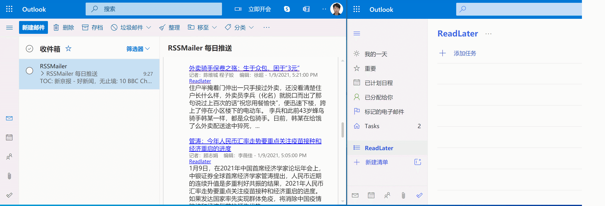

# RSSMailer

获取 RSS 资讯并通过 Email 发送。避免信息爆炸与投喂式信息流，提高信息获取效率。

## Use
1. `mv config.js.example config.js` 编辑配置
2. `npm install`  安装依赖
3. `node index.js`  执行脚本


## Read later

默认启用 read later 功能，删除 `config.js` 中 `readLater` 配置即可关闭。

Read later 通过 [Microsoft Graph API](https://docs.microsoft.com/en-us/graph/api/resources/todo-overview?view=graph-rest-1.0) 实现，首次使用需要可能登录 Outlook 账号。

Read later 数据保存在 Microsoft To Do，优先保存到 ReadLater （需要手动创建），如果没有则保存到 default list。




## Filter

编辑 `config.js` 的 `filter` 配置 RSS 内容有效时效（fresh）与单个 feed 源最大数量（max）。


## crontab

crontab 定时每天早上 8 点定时发送邮件。

- `crontab -e`
- `0 8 * * * cd /path/to/RSSMailer && node index.js`

### 使用 nvm

使用 nvm 需要新建如下 `run.sh` 脚本。

crontab 配置为： `0 8 * * * cd /path/to/RSSMailer && ./run.sh`。
```
#!/bin/sh

export NVM_DIR="$([ -z "${XDG_CONFIG_HOME-}" ] && printf %s "${HOME}/.nvm" || printf %s "${XDG_CONFIG_HOME}/nvm")"
[ -s "$NVM_DIR/nvm.sh" ] && \. "$NVM_DIR/nvm.sh"

node index.js
```